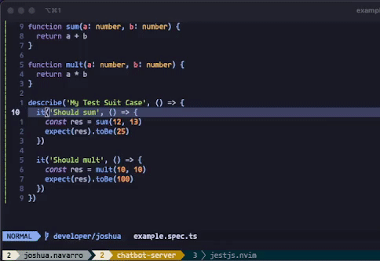

# jestjs.nvim

NeoVim plugin to run JestJS in Lua.

## Demo


## Features

- Run Jest on the whole project.
- Run Jest on the current open file.
- Run Jest on the current test case.
- Run Jest on the whole project and get coverage results.
- Show diagnostic of the test result for the current file (TODO)

## Install

- Requires NeoVim version 0.8 or above.
- Install this plugin like any other Vim plugin, e.g. with [packer.nvim](https://github.com/wbthomason/packer.nvim):
  ```lua
  local use = require('packer').use
  require('packer').startup(function()
    use 'wbthomason/packer.nvim' -- Package manager
    use 'joshnavru/jestjs'
  end)
  ```

## Usage
These are the commands that you can use:

| Command           | Description                                   |
| ----------------- | --------------------------------------------- |
| `:JestJS`         | Run Jest on the whole project.              |
| `:JestJSFile`     | Run Jest on the current open file.          |
| `:JestJSSingle`   | Run Jest on the current test case.          |
| `:JestJSCoverage` | Run Jest on the whole project with coverage |

By default this feature create the following mappings in NORMAL mode:

- `<Leader>jp`: Run Jest on the whole project.
- `<Leader>jf`: Run Jest on the current open file.
- `<Leader>js`: Run Jest on the current selected test case.
- `<Leader>jc`: Run Jest on the whole project and get coverage results.

## Configuration
This plugin needs to be initialised using:

```lua
require("jestjs").setup()
```

However you can pas config options, the desaults are:
```lua
{
  -- Mapping for running tests of the whole project.
  test_project_mapping = "<Leader>jp",
  -- Mapping for running tests of the current open file.
  test_file_mapping = "<Leader>jf",
  -- Mapping for running tests of the current selected test case.
  test_single_mapping = "<Leader>js",
  -- Mapping for runnign tests and get the coverage results.
  test_coverage = "<Leader>jc",
}
```
